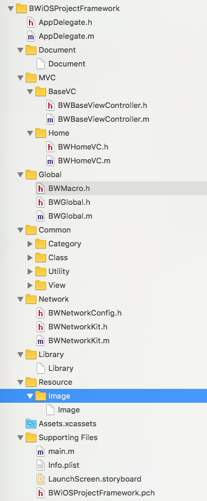

#BWProjectFramework

iOS Xcode Project Framework

##Content  
* Xcode项目架构
* Xcode项目文件结构
* Xcode项目代码架构
* iOS项目框架经验
* Follow Me

##Xcode项目架构
* 掌握Xcode管理项目文件的机制；  
* 除了Xcode作为开发iOS应用的IDE以外，也有JetBrains的AppCode，因此在此讨论的项目架构是基于Xcode作为IDE来讨论的；  
* 使用CocoaPods对第三方库类进行管理，善于使用稳定可靠的开发工具，有助于提高开发效率；
* 在此为基于Objective-C语言开发的Xcode项目架构

##Xcode项目文件结构

### 文件结构概览

AppDelegate Class

Document

MVC

Global

Common

Network

Library

Resource

Assets.xcassets

Supporting Files

### 文件结构图示

### 文件结构设计

* AppDelegate Class
* Document
* MVC
  * BaseVC
    * BaseViewController
  * Home
    * Controller
    * Model
    * View
  * OtherFunctionEntries
    * Controller
    * Model
    * View
* Global
  * Macro
  * Global Class
  * User Class
* Common
  - Category
  - Class
  - Utility
    - FunctionManager
  - View
    - CustomView
* Network
  * NetworkConfiguration.h
  * NetworkKit Class
* Library
* Resource
  * Image
  * Configuration
  * Database
  * Sound
  * Vedio
* Assets.xcassets
* Supporting Files
  * main.m
  * Info.plist
  * LaunchScreen.storyboard
  * Project.pch

### 文件结构说明  

AppDelegate Class

Document

> 开发文档

MVC

> 基视图控制器
>
> 业务，子目录为Controller，Model，View，如果需要可以添加ViewModel，或者公共业务目录

Global

> 全局类
>
> 项目全局宏定义，全局需要用到的参数，用户参数

Common

> 公共类
>
> 包括了Category，Class，Utility，View

Network

> 网络框架

Library

> 引入的第三方库

Resource

> 资源目录

Assets.xcassets

Supporting Files

> 其他重要的文件
>
> main.m，Info.plist，LaunchScreen.storyboard，项目前缀头文件“.pch”文件

##Xcode项目代码架构  

### MVC  

Model-View-Controller  

### MVVM  

Model-View-ViewModel  

##iOS项目框架经验

* 在此的项目架构为一个常规的架构，通常我们都是需要根据我们App产品具体的需求和业务来做更加合适、合理的架构；  
* 文件结构根据复杂业务进行进一步地扩展；
* MVC做好职责分配，以让复杂业务也能有很好的可维护性；
* MVVM如何更好的融入到项目架构中；
* 总之，灵活的为具体的项目做好架构；

##Follow Me
Github：https://github.com/bobwongs

本项目Github：https://github.com/bobwongs/BWiOSProjectFramework

Blog: http://www.bobwongs.com